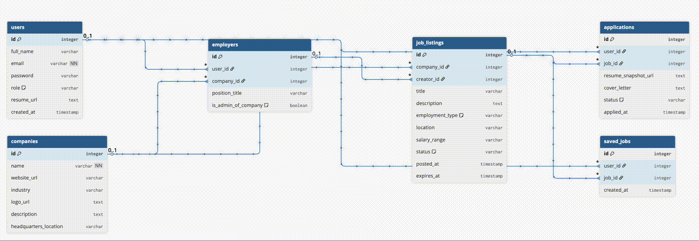

# 🍹 OopsAllLaravel

> *A public Laravel playground powered by Laracasts — learning the framework one bug, fix, and “aha!” moment at a time.*

---

## 📌 About This Repository

This repository exists for **learning Laravel in public**. I am actively following **Laracasts tutorials** and implementing everything hands-on instead of just watching videos.

Think of this repo as:

* A **practice lab** 🧪
* A **skill-building gym** 💪
* A **safe place to break things and fix them** 🔧

Mistakes are intentional. Learning is guaranteed.

---

## 🗄️ Database Structure Demo

Below is a short visual demo showing the **current database structure and relationships** as they evolve during development:



---

## 🎯 Goals

* Build a strong foundation in **Laravel fundamentals**
* Practice **Eloquent ORM**, routing, controllers, middleware, queues, and authentication
* Understand **real-world Laravel architecture**
* Write cleaner, more maintainable code over time

---

## 🧠 What I’m Practicing

* ✅ Routing & Controllers
* ✅ Blade & Views
* ✅ Eloquent ORM & Relationships
* ✅ Authentication & Authorization
* ✅ Queues & Jobs
* ✅ Migrations & Seeders
* ✅ API development (JWT / Sanctum)
* ⏳ Testing & Best Practices

> Topics will grow as learning progresses 🚀

---

## 🛠️ Tech Stack

* **PHP** 8.2+
* **Laravel** (latest)
* **MySQL / PostgreSQL**
* **Composer**
* **Laracasts** 🎓

---

## 🚀 Getting Started

Clone the repository:

```bash
git clone https://github.com/akbar-dev-200/laravel-and-chill.git
cd laravel-and-chill
```

Install dependencies:

```bash
composer install
```

Set up environment:

```bash
cp .env.example .env
php artisan key:generate
```

Run the server:

```bash
php artisan serve
```

Visit:

```
http://127.0.0.1:8000
```

---

## ⚠️ Disclaimer

This is **not a production-ready project**.

* Code may change frequently
* Features may break
* Experiments may fail

That’s the whole point 😄

---

## 📚 Learning Source

* 🎥 **Laracasts** — Hands down one of the best platforms to learn Laravel properly.

---

## 🤝 Contributing

This is primarily a personal learning repo, but:

* Suggestions are welcome
* Improvements are appreciated
* Feedback is encouraged

---

## ⭐ Final Note

If you’re also learning Laravel:

* Fork it
* Break it
* Fix it
* Learn from it

**Laravel and Chill 😎**

---

Happy coding 🚀
